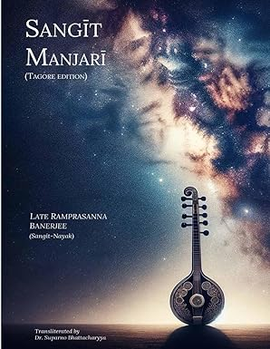

---
format:
  html:
    toc: false
    css: styles.css
---

::: {style="text-align: center; margin-bottom: 40px;"}
# Sangīt Manjarī
:::

::: {.column-margin}
```{=html}
<div class="amazon-card">
  <div class="amazon-card-image">
    
  </div>
  
  <div class="amazon-card-content">
    <h4>Sangīt Manjarī: Tagore Edition</h4>
    <p>By Ramprasanna Banerjee, Dr. Suparno Bhattacharya, Pt. Arijit Mahalanabis</p>
    
    <a href="[Click to buy]((https://www.amazon.com/Sangi%CC%84t-Manjari%CC%84-Tagore-Ramprasanna-Banerjee/dp/B0F9Q2TPQ7?crid=OMD8EMUVRRN&dib=eyJ2IjoiMSJ9._sZF7mMtJZ5G58VDw-sr_w.ho2ccy0ZKJyDsemK527np1V5NDaRP95lgPHHUxTBcXs&dib_tag=se&keywords=sangit+manjari&qid=1778421182&sprefix=sangit+manjar%2Caps%2C364&sr=8-1)" target="_blank" rel="noopener noreferrer" class="amazon-button">
      View on Amazon
    </a>
  </div>
</div>`
```
:::

::: {style="text-align: justify; font-size: 1.05em; line-height: 1.7;"}
Preserving India’s musical heritage means balancing deep respect for tradition with thoughtful documentation. Much of Indian classical music has been passed down orally through the guru-shishya system, creating profound, personal learning—but also making the tradition vulnerable to loss without written records. Saving old bandishes is not just archival work; it’s about keeping the voices of past generations alive for today and tomorrow.

Saṅgīt Manjarī is a key step in this endeavor. Compiled by Pt. Ramprasanna Bandyopadhyay of the Bishnupur Gharānā and first published in 1907, it is one of the earliest written collections of a gharānā’s music, drawing on both his father's teaching and the broader Bishnupur tradition. The collection is remarkable for its range: while Dhrupad is central, it also features Khayāl, Tappā, Thumri, Chaturang, Jhulan, Trivat, and Thillānā—few works from that era showcase such diversity. Later, around 1935, Pt. Ramprasanna’s brother, Pt. Gopeswar Bandyopadhyay, expanded and edited the book, helping it serve as a core resource for musicians and scholars.

Despite its importance, Saṅgīt Manjarī has long been difficult to access. Scanned versions online are in Braj Bhasha, written with Bengali script, making them hard for most modern readers. Guided by my teacher, Guruji Pt. Arijit Mahalanabis—whose deep knowledge and pioneering work on reviving rare musical texts inspired this project—our team created a new edition (now available on Amazon). This version transliterates the original Braj into Roman script, corrects minor errors, and presents the music using Bhatkhande notation widely adopted in Indian classical music. Our goal is to stay true to the original while making it relevant and accessible today.

This website is the companion to that book. Here, you will find a digital selection of compositions from Saṅgīt Manjarī. Rather than simply reproduce the original, our aim is to make these materials practical and inspiring for the next generation.

Because Saṅgīt Manjarī is so extensive, we are releasing material in installments. The first set features compositions that influenced our national poet Viswakavi Rabindranath Tagore, highlighting the Bishnupur Gharānā’s unique impact on his music and, more broadly, on modern Bengali music.

Ultimately, we hope this project will help preserve India’s musical legacy by combining careful editing with digital sharing. We invite others working with different gharānās to join in and help revive more rare musical traditions.
:::